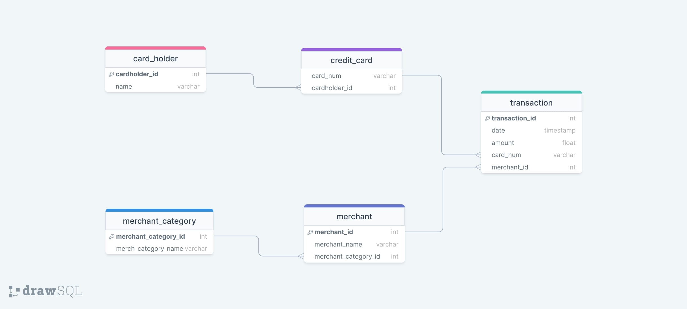
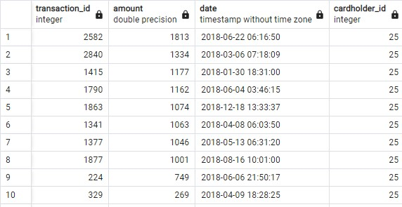

# Unit 7 Homework Assignment: Looking for Suspicious Transactions

*[Credit Card Fraudster by Richard Patterson](https://www.flickr.com/photos/136770128@N07/42252105582/) | [Creative Commons Licensed](https://creativecommons.org/licenses/by/2.0/)*

## Background

Fraud is prevalent these days, whether you are a small taco shop or a large international business. While there are emerging technologies that employ machine learning and artificial intelligence to detect fraud, many instances of fraud detection still require strong data analytics to find abnormal charges.

In this homework assignment, you will apply your new SQL skills to analyze historical credit card transactions and consumption patterns in order to identify possible fraudulent transactions.

You are asked to accomplish three main tasks:

1. [Data Modeling](#Data-Modeling):
Define a database model to store the credit card transactions data and create a new PostgreSQL database using your model.

2. [Data Engineering](#Data-Engineering): Create a database schema on PostgreSQL and populate your  database from the CSV files provided.

3. [Data Analysis](#Data-Analysis): Analyze the data to identify possible fraudulent transactions trends data, and develop a report of your observations.

---

## Files

* [card_holder.csv](Data/card_holder.csv)
* [credit_card.csv](Data/credit_card.csv)
* [merchant.csv](Data/merchant.csv)
* [merchant_category.csv](Data/merchant_category.csv)
* [transaction.csv](Data/transaction.csv)

## Instructions

### Data Modeling

Create an entity relationship diagram (ERD) by inspecting the provided CSV files.

Part of the challenge here is to figure out how many tables you should create, as well as what kind of relationships you need to define among the tables.

Feel free to discuss your database model design ideas with your classmates. You can use a tool like [Quick Database Diagrams](https://www.quickdatabasediagrams.com) to create your model.

**Hints:** 

* For the `credit_card` and `transaction` tables, the `card` column should be a VARCHAR(20) datatype rather than an INT.
* For the `transaction` table, the `date` column should be a TIMESTAMP datatype rather than DATE.

See the Fraud Detection DB Digram

Fraud_Detection_DB_Diagram

### Data Engineering

Using your database model as a blueprint, create a database schema for each of your tables and relationships. Remember to specify data types, primary keys, foreign keys, and any other constraints you defined.

After creating the database schema, import the data from the corresponding CSV files.

### Data Analysis
#### Part 1:

The CFO of your firm has requested a report to help analyze potential fraudulent transactions. Using your newly created database, generate queries that will discover the information needed to answer the following questions, then use your repository's ReadME file to create a markdown report you can share with the CFO:

* Some fraudsters hack a credit card by making several small transactions (generally less than $2.00), which are typically ignored by cardholders. 

  * How can you isolate (or group) the transactions of each cardholder?

  * Count the transactions that are less than $2.00 per cardholder. 
  
  * Is there any evidence to suggest that a credit card has been hacked? Explain your rationale.

* Take your investigation a step futher by considering the time period in which potentially fraudulent transactions are made. 

  * What are the top 100 highest transactions made between 7:00 am and 9:00 am?

  * Do you see any anomalous transactions that could be fraudulent?

  * Is there a higher number of fraudulent transactions made during this time frame versus the rest of the day?

  * If you answered yes to the previous question, explain why you think there might be fraudulent transactions during this time frame.

* What are the top 5 merchants prone to being hacked using small transactions?

* Create a view for each of your queries.

#### Part 2:

Your CFO has also requested detailed trends data on specific card holders. Use the [starter notebook](Starter_Files/challenge.ipynb) to query your database and generate visualizations that supply the requested information as follows, then add your visualizations and observations to your markdown report:      

* The two most important customers of the firm may have been hacked. Verify if there are any fraudulent transactions in their history. For privacy reasons, you only know that their cardholder IDs are 2 and 18.

  * Using hvPlot, create a line plot representing the time series of transactions over the course of the year for each cardholder separately. 
  
  * Next, to better compare their patterns, create a single line plot that contains both card holders' trend data.  

  * What difference do you observe between the consumption patterns? Does the difference suggest a fraudulent transaction? Explain your rationale.

* The CEO of the biggest customer of the firm suspects that someone has used her corporate credit card without authorization in the first quarter of 2018 to pay quite expensive restaurant bills. Again, for privacy reasons, you know only that the cardholder ID in question is 25.

  * Using hvPlot, create a box plot, representing the expenditure data from January 2018 to June 2018 for cardholder ID 25.
  
  * Are there any outliers for cardholder ID 25? How many outliers are there per month?

  * Do you notice any anomalies? Describe your observations and conclusions. 
  In average, cardholder ID 25's transactions are between $2 and $20. However, there are quite few outliers: These are outliers between January 2018 and June 2018. I would show data as the sequence of the amount and the date: $1,177 on Jan 30 at 6:31 pm, $1,334 on March 6 at 7:18 am, $100 on April 1 at 7:17 am, $1,063 on April 8 at 6:03 am, $269 on April 9 at 6:28 pm, $1,046 on May 13 at 6:31, $1,162 on June 4 at 3:46 am, $749 on June 6 at 9:50, and $1,813 on June 22 at 6:16 am. 

### Challenge

Another approach to identifying fraudulent transactions is to look for outliers in the data. Standard deviation or quartiles are often used to detect outliers.

Use the [challenge starter notebook](Starter_Files/challenge.ipynb) to code two Python functions:

* One that uses standard deviation to identify anomalies for any cardholder.

* Another that uses interquartile range to identify anomalies for any cardholder.

For help with outliers detection, read the following articles:

* [How to Calculate Outliers](https://www.wikihow.com/Calculate-Outliers)

* [Removing Outliers Using Standard Deviation in Python](https://www.kdnuggets.com/2017/02/removing-outliers-standard-deviation-python.html)

* [How to Use Statistics to Identify Outliers in Data](https://machinelearningmastery.com/how-to-use-statistics-to-identify-outliers-in-data/)

* [Finding outliers in dataset using python](https://medium.datadriveninvestor.com/finding-outliers-in-dataset-using-python-efc3fce6ce32)

### NOTE!

Due to a plot rendring issue on GitHub, Please put the link: https://github.com/keitoronto/Module_7_Challenge/blob/main/visual_data_analysis.ipynb into [nbviewer](https://nbviewer.org/), which will show all plots 

---

© 2022 edX Boot Camps LLC. Confidential and Proprietary. All Rights Reserved.
